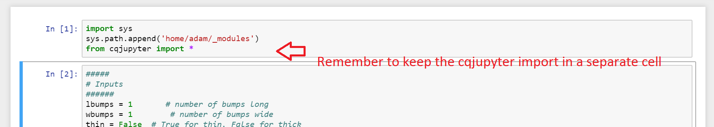

## CQNB - CadQuery Jupyter Notebook

A Jupyter extension for the [CadQuery](https://github.com/dcowden/cadquery) library.

**NOTE:** this extension is still under development. As such, install methods are still manual, and functionality is subject to change.

## Getting Started

This extension has the following requirements:

* [CadQuery](https://github.com/dcowden/cadquery)
	* [FreeCAD 0.16](https://www.freecadweb.org/wiki/Download)
* [Jupyter Notebook](http://jupyter.org/install.html) **NOTE:** Install for Python2.7, as CadQuery only works on 2.7
	* [ipywidgets](https://github.com/jupyter-widgets/ipywidgets)
	* [pythreejs](https://github.com/jovyan/pythreejs)

Currently *cqnb* is used by directly importing the module into your notebook. As such, the installation process is:

1. cd into your desired directory. Must be accessible by your Jupyter server.
2. download cqjupyter.py or clone this repo
	
	git clone https://github.com/RustyVermeer/cqnb.git

3. Import cqjupyter into your notebook.

	import sys
	sys.path.append('/path/to/cqnb/script')
	from cqjuypter import *

**ATTN:** You must place these imports in a cell *separate* from your cadquery script. This is because the CadQuery interface runs into trouble when it reads the line 'import cqjupyter'. 

If you wish to avoid having to import the script in your notebook, you can add a short script to your startup folder that contains the above import statements.

It's a simple process and you can read about it [here](https://stackoverflow.com/questions/32211109/automate-standard-jupyter-ipython-notebook-imports).